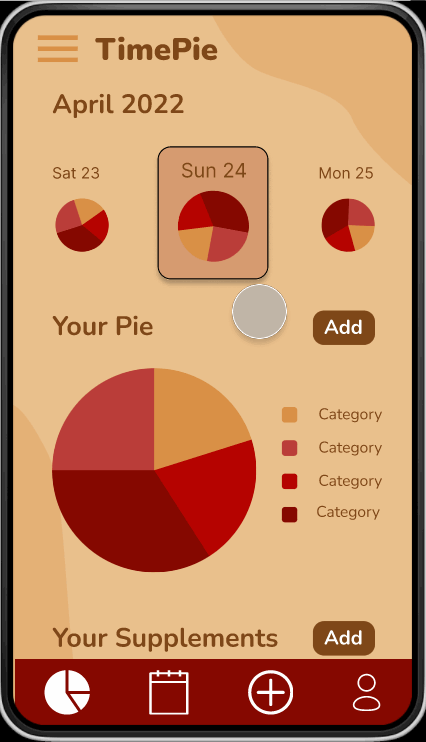

# TimePie

## Table of Contents

1. [Overview](#Overview)
1. [Product Spec](#Product-Spec)
1. [Wireframes](#Wireframes)
1. [Schema](#Schema)

## Overview

### Description

This app helps you keep track of the medical supplements you need to take and how you spend your days, similar to a bullet journal. It also allows you to reflect on your day, week, year, etc.

### App Evaluation

- **Category:** Calendar/Journaling
- **Mobile:** personalized to each user, notifications, push, real-time updates
- **Story:** Keep track of medical supplements and balanced mental health
- **Market:** Anyone who takes medicine on a regular basis and wants to journal or track parts of their life
- **Habit:** Habit-forming because users need to input and check when to regularly take their medicine. They are also encouraged to write down how they are feeling and what they are thinking, which can become a regular activity.
- **Scope:** Clearly defined and buildable in a month.

## Product Spec

### 1. User Stories (Required and Optional)

**Required Must-have Stories**

- Sign up to create an account
- Log in and log out of app
- Create categories for their daily activities
- View category progress and time spent
- Input supplements you need to take
- View a specific day/week/year
- View reflection notes
- View overarching calendar

**Optional Nice-to-have Stories**

- Import third-party information

### 2. Screen Archetypes

- Login
  - Sign up to create an account
  - Log in and log out of app
- Main calendar view
  - View overarching calendar
- Category input view
  - Create categories for their daily activities
- Category detail view
  - View category progress and time spent
- Supplement input view
  - Input supplements you need to take
- Supplement detail view
  - View a specific day/week/year
- Reflection view
  - View reflection notes
- Day detail view
  - View a specific day/week/year
- Week detail view
  - View a specific day/week/year
- Year detail view
  - View a specific day/week/year

### 3. Navigation

**Tab Navigation** (Tab to Screen)

- Supplement input
  - Supplement input view
- Reflection input
  - Reflection input view
- Category input
  - Category input view

**Flow Navigation** (Screen to Screen)

- Login Screen
  - Sign Up
  - Log In
- Main calendar view
  - Tab Navitaion
  - Kebab menu (3-dot on right-hand side)

## Wireframes

### [BONUS] Digital Wireframes & Mockups

https://www.figma.com/file/tu74WWDHhlAGpXwdimLdZo/Untitled?node-id=0%3A1

### [BONUS] Interactive Prototype

## Schema

### Models

**Supplement**

| **Property**    | **Type**        | **Description**                                            |
| --------------- | --------------- | ---------------------------------------------------------- |
| name            | String          | name of supplement                                         |
| dailyFrequency  | Int             | number of intake per day                                   |
| weeklyFrequency | List of Boolean | each position represents which day the supplement is taken |
| intake          | Dictionary      | key is time, value is dose                                 |
| time            | DateTime        | time to remind user                                        |
| dose            | Int             | number of dose per intake                                  |

**Reflection**

| **Property** | **Type** | **Description**                              |
| ------------ | -------- | -------------------------------------------- |
| reflectionId | String   | unique id for the reflection (defailt field) |
| month        | DateTime | month of the reflection                      |
| day          | DateTime | day of the reflection                        |
| year         | DateTime | year of the reflection                       |
| content      | String   | the reflection                               |
| rating       | Int      | score out of 10 for the day                  |

**Category**

| **Property**  | **Type** | **Description**                              |
| ------------- | -------- | -------------------------------------------- |
| categoryId    | String   | unique id for the reflection (default field) |
| name          | String   | name of category                             |
| description   | String   | description of category                      |
| goal          | Int      | amount of time you want to spend on category |
| daily_status  | Int      | amount of time spent on category in the day  |
| weekly_status | Int      | amount of time spent on category in the week |
| yearly_status | Int      | amount of time spent on category in the year |

### Networking

- Login
  - (Create/POST) Create a new user
  - (Read/GET) Query user to log in
- Category input view
  - (Create/POST) Create a new category
  - (Update/PUT) Update an existing category
- Category detail view
  - (Read/GET) View an existing category
- Supplement input view
  - (Create/POST) Create a new supplement
  - (Update/PUT) Update an existing supplement
- Supplement view
  - (Read/GET) View all existing supplements
- Reflection view
  - (Create/POST) Create a new reflection
